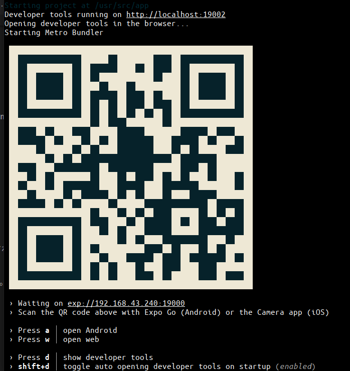

Dockerを使ってReact Nativeの環境構築をしました。


## 環境構築
### Dockerのインストール
[ここ](https://docs.docker.com/engine/install/)とか見ながら頑張る

```
$ docker --version                  
Docker version 20.10.5, build 55c4c88
```

### Docker composeのダウンロード、インストール
` sudo ln -s /usr/local/bin/docker-compose /usr/bin/docker-compose ` だけでもOKかも。

```sh
$ sudo curl -L "https://github.com/docker/compose/releases/download/1.24.1/docker-compose-$(uname -s)-$(uname -m)" -o /usr/local/bin/docker-compose

$ sudo chmod +x /usr/local/bin/docker-compose

$ sudo ln -s /usr/local/bin/docker-compose /usr/bin/docker-compose

$ docker-compose version
docker-compose version 1.24.1, build 4667896b
docker-py version: 3.7.3
CPython version: 3.6.8
OpenSSL version: OpenSSL 1.1.0j  20 Nov 2018
```


# 使用方法

まずDockerコンテナをバックグランドで起動します。
```sh
$ docker-compose up -d
```

`docker ps -a`コマンドを実行して`docker-react-template_node `イメージから作成されたコンテナが動いていればOKです。


 Dockerの中に入ります
```
$ docker-compose exec node /bin/bash
```


```
# プロジェクトを作成
bash-5.0#  expo init .
? Choose a template: › - Use arrow-keys. Return to submit.
    ----- Managed workflow -----
❯   blank                 a minimal app as clean as an empty canvas
    blank (TypeScript)    same as blank but with TypeScript configuration
    tabs (TypeScript)     several example screens and tabs using react-navigation and TypeScript
    ----- Bare workflow -----
    minimal               bare and minimal, just the essentials to get you started
    minimal (TypeScript)  same as minimal but with TypeScript configuration
```
blankを選択してEnterを押すと、色々セットアップが開始される。

待っていると`✅ Your project is ready!`と言われました。プロジェクトが作成されたっぽい！

```
$ yarn start
```
を実行すると、

QRコードが表示されます。

これを、Androidスマホで読み取るとアプリが起動します。
[Expo](https://play.google.com/store/apps/details?id=host.exp.exponent&hl=ja&gl=US)というアプリを起動し、「Scan QR Code」みたいなのをクリックしてQRコードをスキャンすると、アプリが表示されます。※同じネットワークに入っている必要がある


ちなみに、プロジェクトを止めるには`Ctrl + D → Ctrl + C`でOKです。


```
$yarn web
```
を実行して、表示されたローカルのIPアドレスにアクセスするとWebバージョンも見ることができます。


```
yarn android
yarn ios
yarn web
```
のようなコマンドもあるらしい


## Android Emulatorのインストール
[ここらへんのサイト](https://andresand.medium.com/android-emulator-on-docker-container-f20c49b129ef)などを見ながら頑張ってるけどなかなかうまく行かない。


## VsCodeでReactを動かす
https://qiita.com/t_okkan/items/2b6b94340b837189054c

そんなこともできるのか！！


# 参考サイト
React Native側：https://qiita.com/h-yoshikawa44/items/51b631ec0a6beabdce2d

https://qiita.com/mtsiga/items/f90a3b8edd3ab58de376


